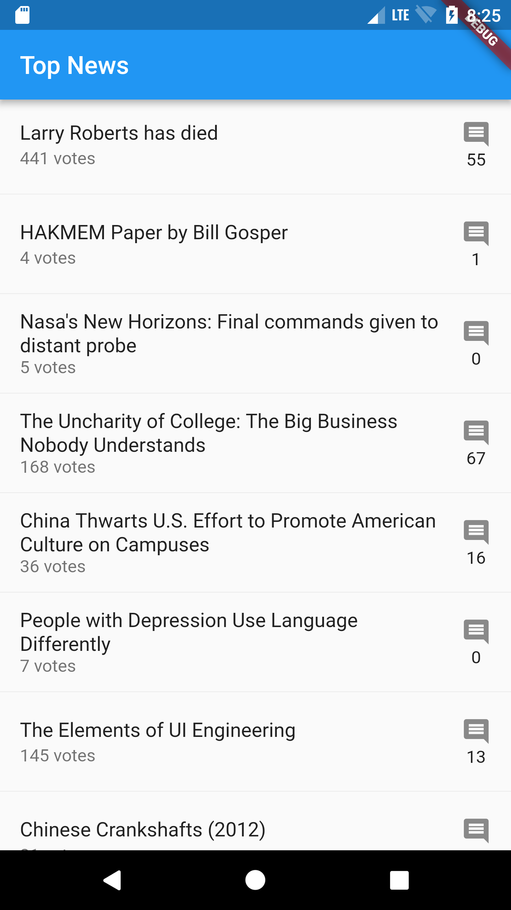

# flutter hackernews example

유데미 강좌를 보고 실습한 내용입니다. 

- [강좌](https://www.udemy.com/dart-and-flutter-the-complete-developers-guide) 
- [HackerNews Api](https://github.com/HackerNews/API)

- Flutter
- Bloc Pattern
- RxDart
- Stream Transform

## Getting Started

This project is a starting point for a Flutter application.

A few resources to get you started if this is your first Flutter project:

- [Lab: Write your first Flutter app](https://flutter.io/docs/get-started/codelab)
- [Cookbook: Useful Flutter samples](https://flutter.io/docs/cookbook)

For help getting started with Flutter, view our 
[online documentation](https://flutter.io/docs), which offers tutorials, 
samples, guidance on mobile development, and a full API reference.
